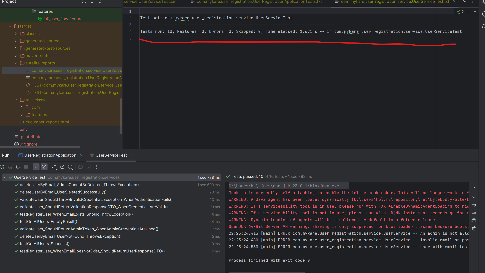
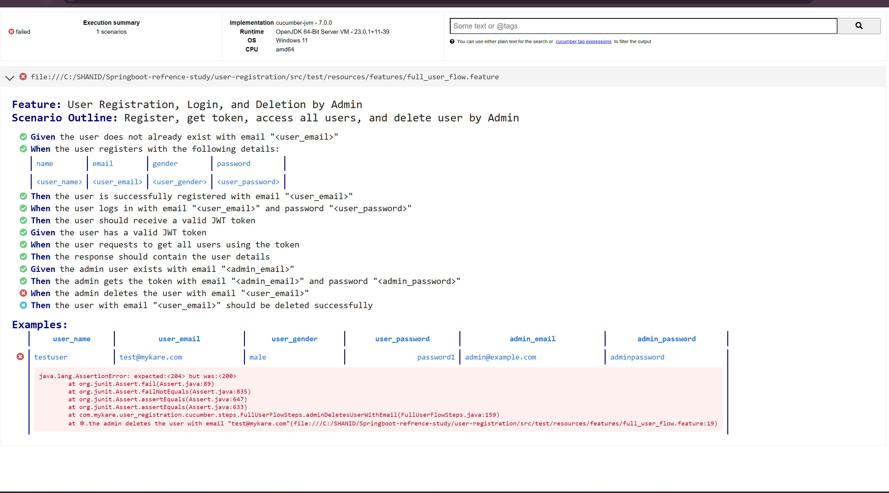
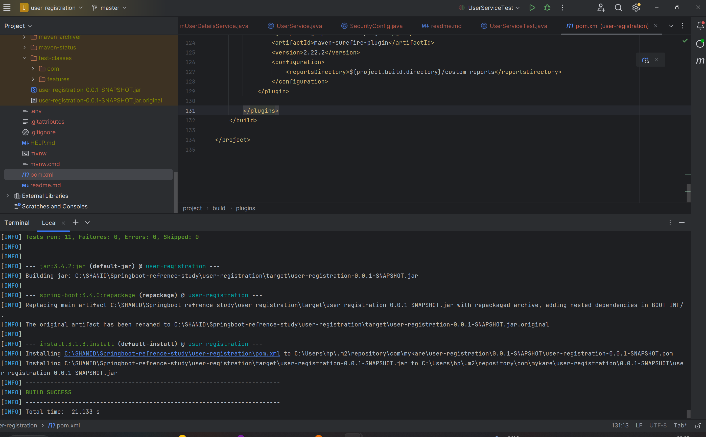
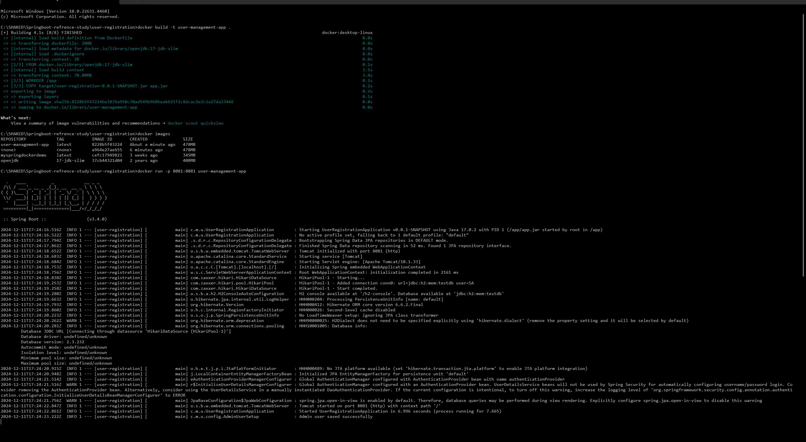
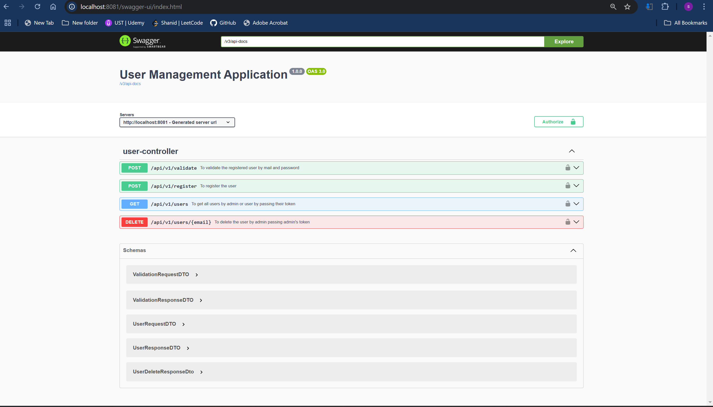

README

# User Management Application

This project implements a User Management API using Java, Spring Boot, JUnit, Cucumber, and Docker. 
It includes functionalities for user registration, validation, authentication, retrieving all users, and deleting a user. 
The application follows best practices for security, exception handling, and logging, and it is containerized for easy deployment.

## Features

**User Registration API**

_Allows registration of a user with the following details:_
* Name
* Email (must be unique)
* Gender
* Password

_Validates that email is unique to avoid duplicate registrations._

**User Validation API**

* Validates the user using email and password.
* Utilizes Spring Security for authentication.
* On successful validation, returns a JWT token.
* The JWT secret key and expiration time are configurable in the application.properties file.

**Get All Users API**

* Returns all registered users.
* Protected API: Requires a valid JWT token.
* Accessible by both admin and user roles.

**Delete User API**

* Deletes a user based on the provided email.
* Protected API: Only admin can delete users.
* Admin cannot delete themselves.
* Proper exception handling is implemented.

**Role Management**

* The application includes an admin role, configurable via the application.properties file.
* Only one admin is allowed to manage the application.

**Security**

* Authentication uses Spring Security with JWT.
* Tokens are securely configured in the application.properties file.

**Testing**

_Unit Tests:_ 
* Covers all service-layer methods using JUnit (10 unit tests).

_End-to-End Tests:_ 
* Uses Cucumber for Behavior-Driven Development (BDD) testing(1 e2e test).

_Build Success_

**Database**

* Uses H2 in-memory database for easy testing and development.
* In production, this can be replaced with a more robust database.

**Docker Support**

* The application includes a Dockerfile to containerize the application for consistent deployment.

**Swagger Integration**

* API documentation and testing are available via Swagger UI.

* Swagger url - http://localhost:8080/swagger-ui/index.html

## **Sample Data**
This is not a comprehensive set of test cases but rather sample data intended for testing the application. 
While some error responses associated with the APIs are included, 
the list does not cover all negative scenarios or their corresponding responses.

### _**REGISTER A USER**_

**URL -** 
http://localhost:8081/api/v1/register

**METHOD -** 
POST

**REQUEST -** 
`{
"name": "shanid vp",
"email": "shanid.vp@example.com",
"gender": "Male",
"password": "password456"
}`

**RESPONSE -**
`{
"id": 2,
"name": "shanid vp",
"email": "shanid.vp@example.com",
"gender": "MALE",
"role": "USER"
}`

**ERROR RESPONSE WHEN WE TRY TO REGISTER USER WITH EXISTING E-MAIL -**
`{
"message": "User with email shanid.vp@example.com already exists",
"status": 400,
"details": "User already exists"
}`

### _**VALIDATE A USER/ADMIN**_

**URL -**
http://localhost:8081/api/v1/validate
**METHOD -**
POST

**REQUEST -**
`{
"email": "shanid.vp@example.com",
"password": "password456"
}`

**RESPONSE -**
`{
"message": "User validated successfully",
"token": "<TOKEN>",
"expirationAfter": "1 hour"
}`

**ERROR RESPONSE WHEN WE TRY INVALID E-MAIL OR PASSWORD -**
`{
"message": "Invalid email or password",
"status": 401,
"details": "Invalid credentials provided"
}`

### _**GET ALL USER BY PASSING TOKEN OF USER/ADMIN**_

**URL -**
http://localhost:8081/api/v1/users

**METHOD -**
GET

**REQUEST PARAM -**
`page,
size`

**RESPONSE -**
`[
{
"id": 1,
"name": "Admin",
"email": "admin@example.com",
"gender": "NOT_MENTIONED",
"role": "ADMIN"
},
{
"id": 2,
"name": "shanid vp",
"email": "shanid.vp@example.com",
"gender": "MALE",
"role": "USER"
}
]`

**ERROR RESPONSE WHEN WE TRY INVALID TOKEN -**
`{
"message": "Invalid token",
"error": "Unauthorized"
}`

### _**DELETE A USER BY ADMIN**_

**URL -**
http://localhost:8081/api/v1/users

**METHOD -**
GET

**PATH PARAM -**
`email of user`

**RESPONSE -**
`{
"email": "shanid.vp@example.com",
"message": "User deleted successfully"
}`

**ERROR RESPONSE WHEN WE TRY TO DELETE ADMIN -**
`{
"message": "An admin is not allowed to delete admin.",
"status": 403,
"details": "Access denied"
}`

